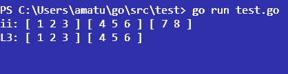
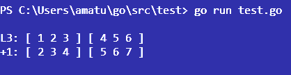

# f
f is a functional slice library

```
go get github.com/mrmiguu/f
```



```go
import "github.com/mrmiguu/f"

lenThree := func(ii []int) bool {
    return len(ii) == 3
}

printInt := func(i int) {
    fmt.Print(i, " ")
}

printInts := func(ints []int) {
    fmt.Print("[ ")

    // int slice each
    f.EachInt(ints, printInt)

    fmt.Print("] ")
}

ii := [][]int{
    {1, 2, 3},
    {4, 5, 6},
    {7, 8},
}

fmt.Print("ii: ")

// generic each
f.Each(ii, printInts)

fmt.Println()
fmt.Print("L3: ")

// generic find
jj := f.Find(ii, lenThree)

f.Each(jj, printInts)
fmt.Println()
```



```go
plusOne := func(i int) int {
    return i + 1
}

incrAll := func(ii []int) []int {
    // int slice map
    return f.MapInt(ii, plusOne)
}

fmt.Print("+1: ")

// generic map
kk := f.Map(jj, incrAll)

f.Each(kk, printInts)
fmt.Println()
```


```go
even := func(i int) bool {
    return i%2 == 0
}

onlyEvens := func(ii []int) []int {
    // int slice find
    return f.FindInt(ii, even)
}

fmt.Print("Ev: ")
ll := f.Map(kk, onlyEvens)
f.Each(ll, printInts)
```

test.go


```go
import "github.com/mrmiguu/f"

func main() {
    plusOne := func(i int) int {
        return i + 1
    }

    incrAll := func(ii []int) []int {
        // int slice map
        return f.MapInt(ii, plusOne)
    }

    lenThree := func(ii []int) bool {
        return len(ii) == 3
    }

    even := func(i int) bool {
        return i%2 == 0
    }

    onlyEvens := func(ii []int) []int {
        // int slice find
        return f.FindInt(ii, even)
    }

    printInt := func(i int) {
        fmt.Print(i, " ")
    }

    printInts := func(ints []int) {
        fmt.Print("[ ")

        // int slice each
        f.EachInt(ints, printInt)

        fmt.Print("] ")
    }

    ii := [][]int{
        {1, 2, 3},
        {4, 5, 6},
        {7, 8},
    }

    fmt.Print("ii: ")

    // generic each
    f.Each(ii, printInts)

    fmt.Println()
    fmt.Print("L3: ")

    // generic find
    jj := f.Find(ii, lenThree)

    f.Each(jj, printInts)
    fmt.Println()
    fmt.Print("+1: ")

    // generic map
    kk := f.Map(jj, incrAll)

    f.Each(kk, printInts)
    fmt.Println()
    fmt.Print("Ev: ")
    ll := f.Map(kk, onlyEvens)
    f.Each(ll, printInts)
}
```
